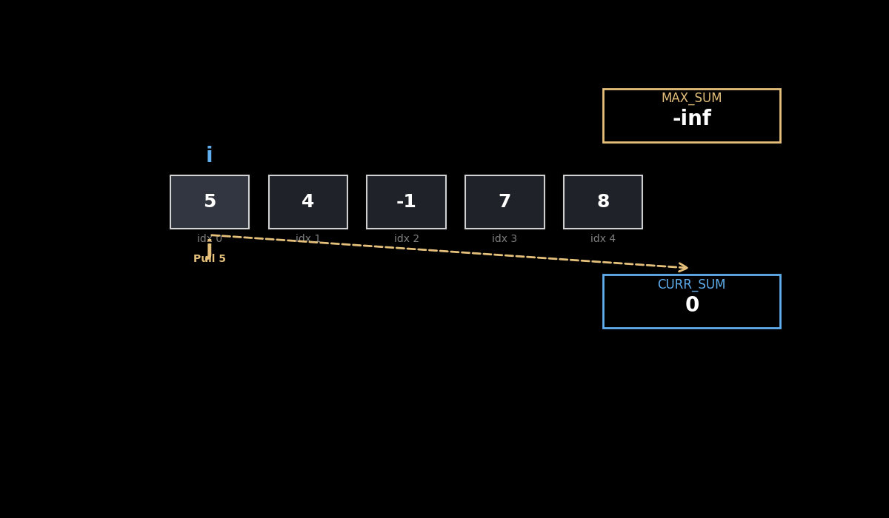
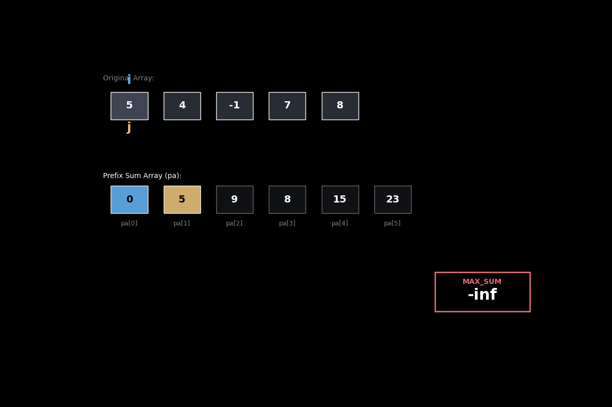

### Running Sum Approach

### Prefix Sum Array Approach

---

## 1. The Looping Mechanism

The most critical realization is that both approaches share the **exact same looping architecture**. Because the nested loop structure is identical, their theoretical time complexity is locked at O(n^2). The only thing that changes is the "payload" inside the inner loop.

### Comparing the "Inner Loop" Work

Inside the  loop, both methods are doing same "Weight Class" work that is effectively O(1).

**Running Sum Approach:**

1. **Fetch:** Get the `curr_sum` currently stored in a variable.
2. **Add:** Add `nums[j]` to that value.
3. **Overwrite:** Store the new total back into `curr_sum`.

**Prefix Sum Approach:**

1. **Fetch:** Get **two** specific values from the precomputed `pa` array (`pa[j+1]` and `pa[i]`).
2. **Subtract:** Subtract the two values to get the range sum.

Even though the math is different, the **time cost** is identical. You haven't "saved" any computations by using a prefix array; you've simply swapped a sequence of additions for a single subtraction.

---

## 2. The Space Complexity Penalty

While the time spent in the loops is the same, the **Space Complexity** is where the Prefix Sum approach takes a massive hit.

* **Running Sum ( Space):** You maintain only **one** relevant variable (`curr_sum`). It is overwritten over and over. You use no extra memory regardless of whether the array has 10 elements or 10 million.
* **Prefix Sum ( Space):** To perform that "one-step subtraction," you first had to build a "Prefix Sum Array" (the `pa` array) to store every possible cumulative sum from the origin. You are paying a heavy memory tax to store data that the Running Sum approach just calculates on the fly.

---

## 3. Low-Level Performance: The Hardware Reality

In a real-world scenario, the **Running Sum** approach will out-perform the Prefix Sum approach due to how CPUs are designed.

### Register-Level Speed

In the Running Sum approach, the `curr_sum` variable is so frequently accessed that the CPU can keep it in a **Register**—the fastest memory available, sitting directly on the processor. It’s like keeping a tool in your hand while you work.

### The Cache Miss Problem

The Prefix Sum approach forces the CPU to jump around. To calculate the subtraction, it has to fetch `pa[j+1]` and `pa[i]`.

* If the array is large, these values might be far apart in memory.
* This leads to **Cache Misses**, where the CPU has to stall and wait for the **RAM** to deliver the data. RAM is significantly slower than the CPU's local cache or registers.

---
